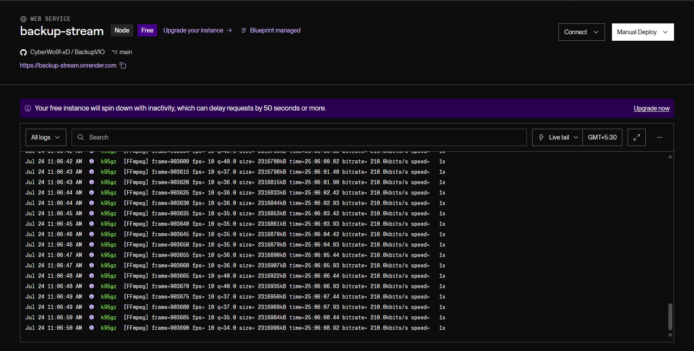

# BackupVIO - Backup Stream Control Panel

A simple and secure web-based control panel for managing backup streams. This application allows you to start and stop backup streams through a web interface with password protection.



## Features

- 🔒 Password-protected control panel
- 🎮 Simple start/stop stream controls
- 🌐 Web-based interface
- 🔄 Automatic server keep-alive functionality
- 🐳 Docker support

## Prerequisites

- Node.js (v12 or higher)
- FFmpeg installed on the system
- Docker (optional, for containerized deployment)

## Installation

1. Clone the repository:
```bash
git clone https://github.com/CyberWo9f-xD/BackupVIO.git
cd BackupVIO
```

2. Install dependencies:
```bash
npm install
```

3. Create a `.env` file in the root directory with the following variables:
```env
PORT=3000
PASSWORD=your_secure_password
SELF_URL=https://your-app-url.com  # Optional: for keep-alive functionality
```

## Usage

1. Start the server:
```bash
npm start
```

2. Open your browser and navigate to `http://localhost:3000` (or your configured port)

3. Enter your password and use the control panel to:
   - Start the backup stream
   - Stop the backup stream

## Docker Deployment

1. Build the Docker image:
```bash
docker build -t backupvio .
```

2. Run the container:
```bash
docker run -p 3000:3000 --env-file .env backupvio
```

## API Endpoints

- `GET /` - Serves the control panel interface
- `GET /ping` - Health check endpoint
- `POST /control` - Stream control endpoint (requires password and action parameters)

## Contributing

Feel free to open issues or submit pull requests to improve the project.

## License

[MIT License](LICENSE)

---
Developed by CyberWo9f-xD
